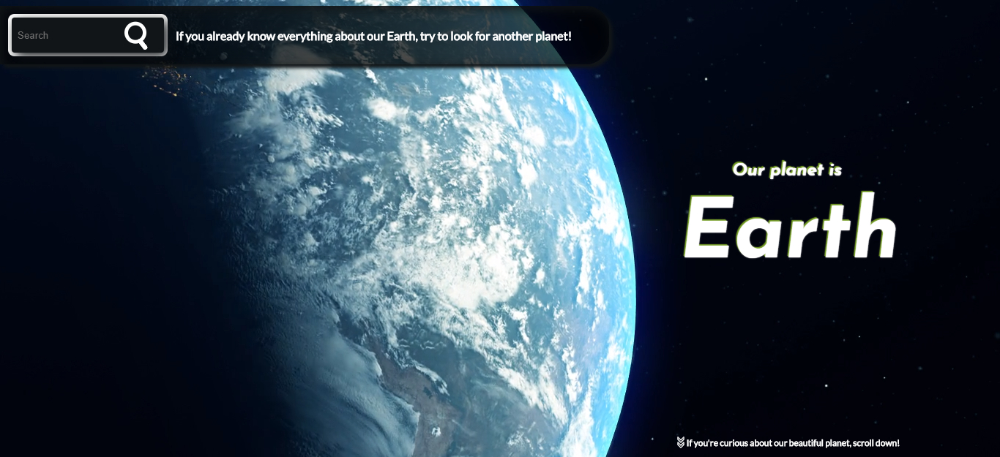
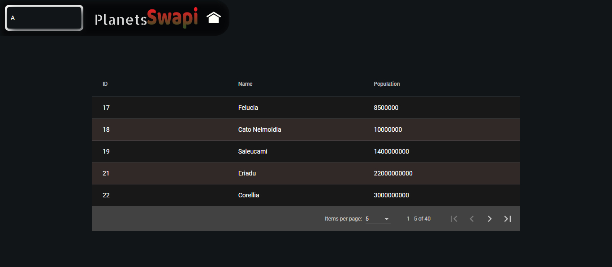
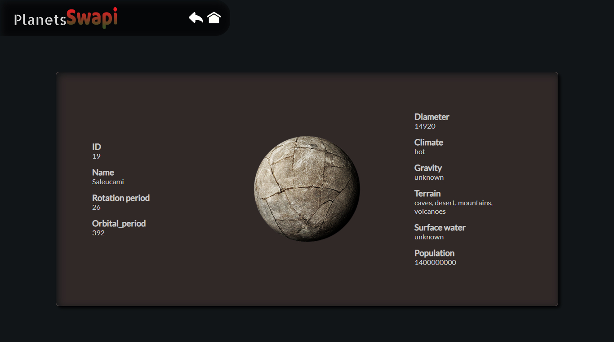

# PlanetsSwapi - cookavsky
**_I used this service - https://swapi.co/api/planets/ and created API in Angular 8.0.0., which consists in searching and presenting planets with its details._**

## Table of contents
* [Getting Started](#getting-started)
* [Screenshots](#screenshots)
* [Acknowledgments](#acknowledgments)
* [Technologies](#technologies)
* [Features](#features)
* [Development server](#development-server)
* [Code scaffolding](#code-scaffolding)
* [Build](#build)
* [Running unit tests](#running-unit-tests)
* [Running end-to-end tests](#running-end-to-end-tests)
* [Status](#status)
* [Author](#author)

## Getting Started
Simple website based on Angular. Retrieves data from the server and displays them on the page. On the page you can search for planets and display their details. The method "run" is shown below.

## Screenshots

## Acknowledgments
### I base my knowledge on the already created API [Spotify Api](https://cookavsky.com/project/Spotify_Api)
### Full Page
#### Inspiration and source: https://codepen.io/juuggo/pen/KbLBZe
### Search Bar
#### Inspiration and source: https://codepen.io/himalayasingh/pen/dqjLgO
### Globe
#### I use globe animation in Portfolio, but source with codepen is not now available
### Local Storage
#### http://plnkr.co/edit/eyywQGgWjhC8gS7Wprcw?p=preview
### Material Angular and table with sorting and page size
#### Inspiration and source: https://material.angular.io + https://github.com/CodAffection/Angular-Material-Data-Table-Paging-Sorting-Filtering
### Loading Data
#### Inspiration and source: https://www.youtube.com/watch?v=cj42D7waOoU

## Technologies
* [Angular CLI](https://github.com/angular/angular-cli) version 8.0.2.
* [Material Angular](https://material.angular.io/) Devkit 6+.

## Features
List of features ready and TODOs for future development:
To Do:
* Find better way to remove score, when is 0 search name
* Loading Data
* Mocking Offline Data
* Animation Table

Finished:
* You can search any planets by planets name
* The following planets information is displayed on the planets list:
- id
- name
- population
* You can select the page size
* The list of planets sort alphabetically
* You can see the details of the selected planets:
- climate
- diameter
- gravity
- name
- orbital_period
- population
- rotation_period
- surface_water
- terrain
- img
- id

## Development server

Run `ng serve` for a dev server. Navigate to `http://localhost:4200/`. The app will automatically reload if you change any of the source files.

To run in website in htaccess add:

`<IfModule mod_rewrite.c>
RewriteEngine On

# If an existing asset or directory is requested go to it as it is
RewriteCond %{DOCUMENT_ROOT}%{REQUEST_URI} -f [OR]
RewriteCond %{DOCUMENT_ROOT}%{REQUEST_URI} -d
RewriteRule ^ - [L]
RewriteCond %{HTTPS} off
RewriteRule (.*) http://%{HTTP_HOST}/project/PlanetsSwapi/index.html
</IfModule>`

## Code scaffolding

Run `ng generate component component-name` to generate a new component. You can also use `ng generate directive|pipe|service|class|guard|interface|enum|module`.

## Build

Run `ng build` to build the project. The build artifacts will be stored in the `dist/` directory. Use the `--prod` flag for a production build.

## Running unit tests

Run `ng test` to execute the unit tests via [Karma](https://karma-runner.github.io).

## Running end-to-end tests

Run `ng e2e` to execute the end-to-end tests via [Protractor](http://www.protractortest.org/).

## Status
Finished.

## Author
Created by **_cookavsky_** [PlanetsSwapi](https://cookavsky.com/project/PlanetsSwapi) - for friends Polska Panda.